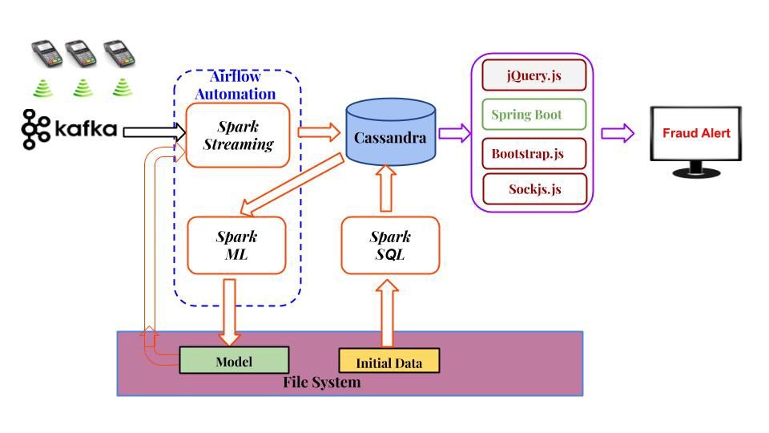

# Real-Time-Credit-Card-Fraud-Detection

## Architecture

## Technologies Used:

1. Spark Streaming:
Utilized Spark Streaming to process and analyze high-velocity data streams in real-time. The framework allowed for the ingestion of data from various sources, enabling continuous processing and immediate response to potential fraudulent activities.

2. Spark ML (Machine Learning):
Leveraged Spark's MLlib library to build and train advanced machine learning models for fraud detection. The ML models were capable of detecting patterns, anomalies, and suspicious behavior within the streaming data.

3. Apache Kafka:
Employed Apache Kafka as the data streaming platform to handle the high-throughput data flow between different components of the fraud detection system. Kafka ensured real-time data processing, message queuing, and fault tolerance.

4. Airflow:
Implemented Apache Airflow as the workflow scheduler and orchestrator, automating the entire data pipeline for the fraud detection system. Airflow allowed for easy monitoring, managing dependencies, and re-running tasks if needed.

5. Cassandra:
Utilized Apache Cassandra as the distributed NoSQL database to store and manage large volumes of real-time data. Cassandra's high availability and scalability were crucial for handling the rapid data ingestion.

6. Springboot:
Developed the user interface and interactive components of the fraud detection system using Springboot. This provided a seamless and user-friendly experience for investigators to monitor and respond to potential fraud cases.
